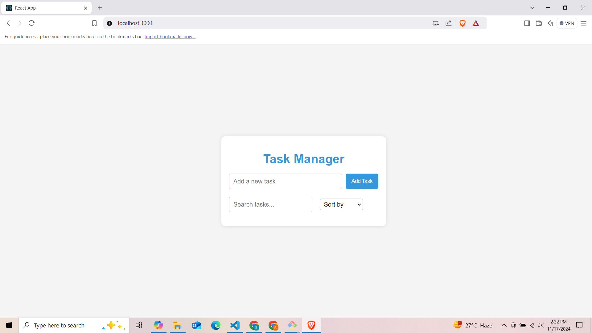
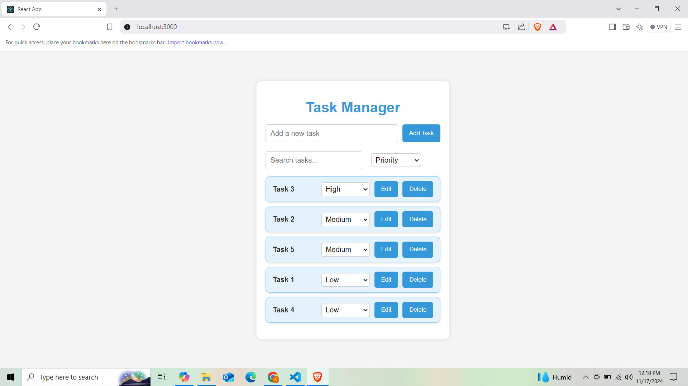
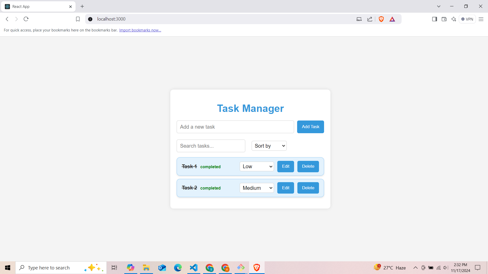

# TaskMaster Pro

**TaskMaster Pro** is a feature-packed task management app designed to help you stay organized and productive. Add, delete, search, prioritize, sort, and complete tasks with ease. Enjoy an intuitive interface with engaging animations to boost your productivity.

## Features

- **Task Input**: Add tasks with a title
- **Task Deletion**: Delete tasks
- **Task Persistence**: Persist tasks in local storage
- **Task Search**: Use a search bar to find tasks
- **Task Completion**: Mark tasks as completed
- **Priority Setting**: Assign a priority level to tasks
- **Task Sorting**: Sort tasks by various criteria
- **UI Animation**: Improve user interface with animations

## Setup and Launch Process

### Installation

1. Clone the repository:
    ```bash
    git clone https://github.com/your-username/TaskMaster-Pro.git
    cd TaskMaster-Pro
    ```

2. Install dependencies:
    ```bash
    npm install
    ```

3. Start the development server:
    ```bash
    npm start
    ```

### Usage

1. Open your browser and navigate to `http://localhost:3000`.
2. Add new tasks, search, and manage them with priority settings, sorting, and completion tracking.

## Assumptions Made During Development

- **Local Storage**: Tasks are persisted using the browser's local storage. This means data is stored locally on the user's device and will not sync across different devices or browsers.
- **Priority Levels**: Tasks can be assigned a priority level from 0 (No Priority) to 3 (High Priority). These levels help in sorting tasks based on their importance.
- **Completed Tasks**: Tasks marked as completed will display a "completed" label next to them and have a strike-through on the title to visually indicate their status.
- **Search Functionality**: The search bar filters tasks based on the title, making it easier to find specific tasks.
- **Editable Tasks**: Users can edit the title of existing tasks, reflecting changes in real-time.

## Screenshots

### Home Screen


### Add Task


### Completed Task


## Contributing

Contributions are welcome! Please fork the repository and submit a pull request with your changes. 

1. Fork the repository
2. Create your feature branch (`git checkout -b feature/YourFeature`)
3. Commit your changes (`git commit -m 'Add YourFeature'`)
4. Push to the branch (`git push origin feature/YourFeature`)
5. Open a pull request

## License

This project is licensed under the MIT License - see the [LICENSE](LICENSE] file for details.

## Acknowledgements

- Thanks to the open-source community for the tools and resources that make projects like this possible.

